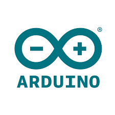
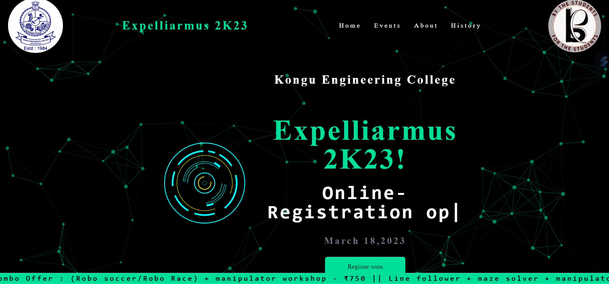
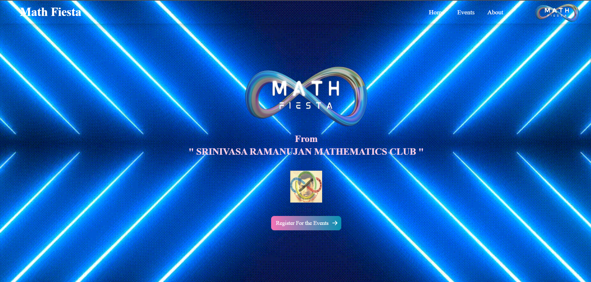

<h1 align="center">Hi 😇, I'm GokulKrishna Raju</h1>
<h3 align="center">A Full stack Mobile App and Web developer from Tamil Nadu, India</h3>

<table>
  <tr>
    <td>
      

    </td>
    <td>
      
    </td>
  </tr>
</table>

## Connect with me :

<table align="center" width="50%">
  <tr>
    <td>
      
    </td>
    <td>
      
    </td>
    <td>
      
    </td>
  </tr>

  <tr>
    <td>
      
    </td>
    <td>
      
    </td>
    <td>
      
    </td>
  </tr>
</table>

## Leetcode

<table>
  <tr>
    <td></td>
    <td></td>
  </tr>
</table>

## Skills

<table width="100%" height="800px">
  <tr>
    <td align="center"> C</td>
    <td align="center"> Java</td>
    <td align="center"> Python</td>
    <td align="center"> Dart</td>
  </tr>
  <tr>
    <td align="center"> HTML5</td>
    <td align="center"> CSS3</td>
    <td align="center"> JavaScript</td>
    <td align="center"> PHP</td>
  </tr>
  <tr>
    <td align="center"> MySQL</td>
    <td align="center"> Node.js</td>
    <td align="center"> React</td>
    <td align="center"> Redis</td>
  </tr>
  <tr>
    <td align="center"> Flutter</td>
    <td align="center"> Firebase</td>
  <td align="center"> Android</td>
  <td align="center"> Android Studio</td>
    
  </tr>
  <tr>
    <td align="center"> Arduino</td>
    <td align="center"> Tailwind CSS</td>
    <td align="center"> Figma</td>
    <td align="center"> Canva</td>
  </tr>
  <tr>
    <td align="center"> Git</td>
    <td align="center"> Linux</td>
  </tr>
</table>

## Live Demo

<table width = "100%">
  <tr>
    <td>
    
    </td>
    <td colspan="2">
      
MOBILE APP    The saying "The most important things in life are the connections you make with others" is so true. Great connections are invaluable, but being a great connection is equally, if not, is most important. Try KEC Connect to easily get the contacts of KEC faculties and Academic Details.

  With KEC Connect you can find faculty details, contacts, Academic schedule and time table on your finger tip.

    </td>
  </tr>
  <tr>
    <td>
    
 WEBSITE    This is the appication for the event Expelliarmus 2K23 conducted by Robotics club of Kongu Engineering College 

    </td>
    <td colspan="2" >
    
    </td>
  </tr>
  <tr>
    <td>
    
 WEBSITE    This is the appication for the event Math Fiesta conducted by  Srinivasa Ramanujan Mathematics Club of Kongu Engineering College 

    </td>
    <td colspan="2" >
    
    </td>
  </tr>
</table>